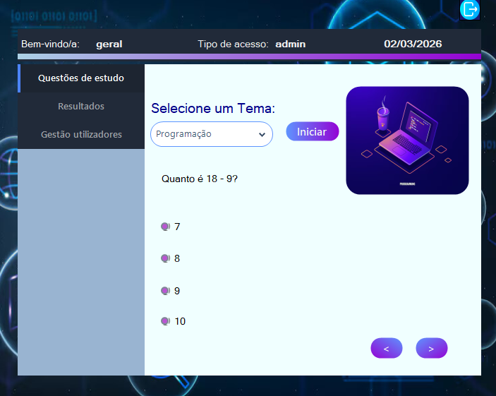
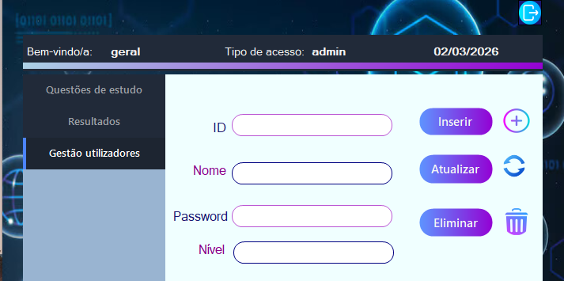

# Educational C# Quiz Application (Windows Forms)

This is a C# Windows Forms project developed as part of an **educational context** to practice GUI development, database management, and quiz logic.  
The project consists of three main modules: login, quiz, and user management.

## Project Modules

### 1. Login Module
- User authentication for the application
- Validates username and password
- Screenshot:

### 2. Quiz Module
- Multiple-choice quizzes for learning support
- Tracks scores and provides feedback
- Screenshot:

### 3. User Management Module
- Admin interface for managing users in the database
- Add, edit, and delete users
- Screenshot:

## Technologies
- C#  
- Windows Forms  
- Local database (for user management)
- Guna Framework - .NET UI/UX

## How to Run
1. Open the solution file (`projecto_final.sln`) in Visual Studio
2. Build the solution
3. Run the application
4. Navigate through the login, quiz, and user management modules
